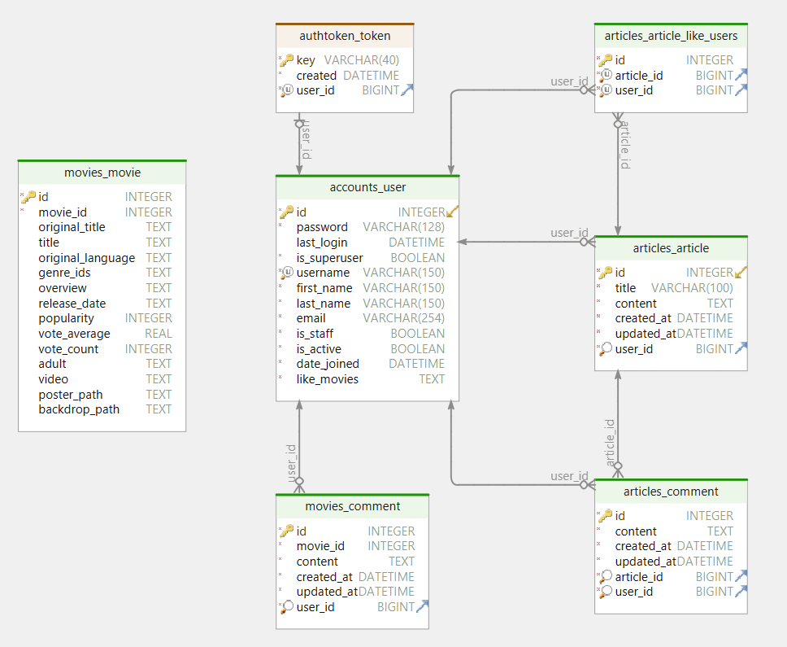

# 230517_movie_community_service

## 개요
- 이름 : 영화 추천 알고리즘 기반 커뮤니티 서비스
- 개요 : 사용자가 자신의 취향과 관심사에 맞는 영화를 추천 받을 수 있고, 다른 사용자와 의견을 공유하며 소통할 수 있는 플랫폼을 제공하기 위한 웹 서비스
- 인원 : 2인 (서준희 : Backend 개발 / 최현우 : Frontend 개발)

## 주요 기능
- 사용자 등록 및 로그인 기능: 사용자는 회원 가입을 통해 계정을 생성하고, 로그인하여 서비스를 이용할 수 있습니다.
- 영화 추천 기능: 간단한 낱말 퍼즐 게임을 통해 영화 추천 알고리즘을 적용하여 개인에게 맞는 영화를 추천합니다.
- 커뮤니티 기능: 사용자들은 영화에 대한 의견과 리뷰를 작성하며, 다른 사용자와의 소통과 토론을 할 수 있는 커뮤니티 기능을 제공합니다.

## 데이터베이스 모델링 

## 상세 기능
- 사용자 등록 및 로그인 (회원가입, 로그인, 프로필 조회)
- 영화 추천 및 조회 (Top Rated, Now Playing, Upcoming, 영화 검색, 영화 추천)
- 커뮤니티 기능 (게시글, 댓글, 좋아요)

## 기타
- [Backend README](./final-pjt-back/README.md)

