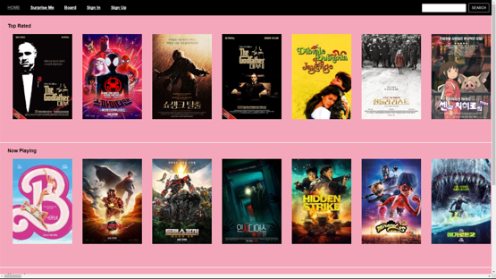
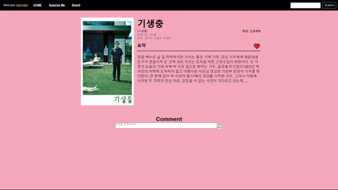
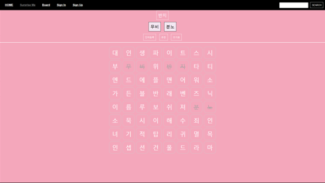
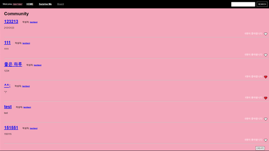
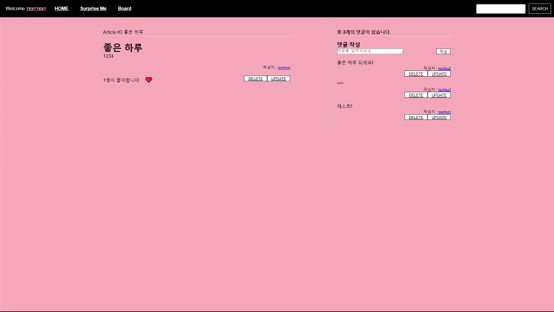
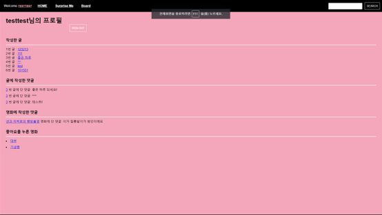
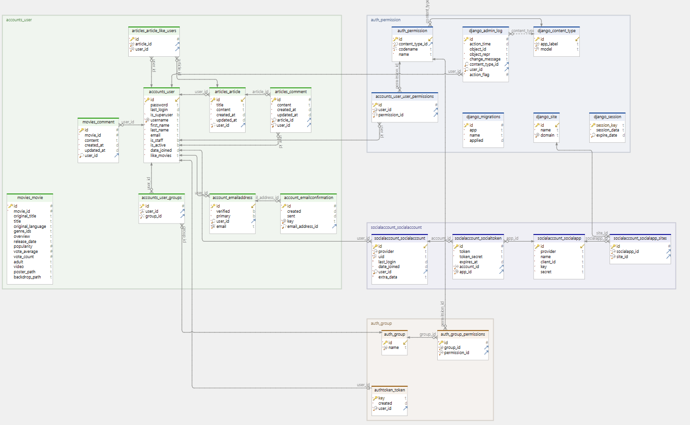
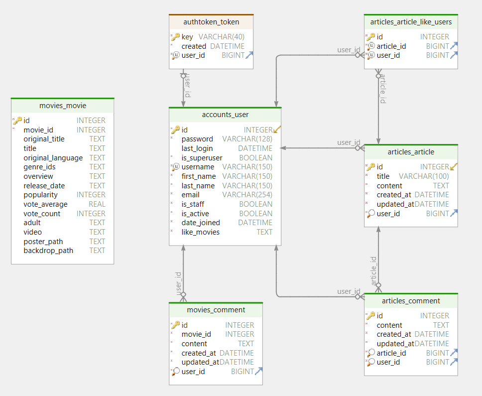

# Movie Community
영화 기반 커뮤니티 서비스

# Summary
- Purpose 
다른 사용자와 의견을 공유하며 소통할 수 있는 플랫폼을 제공하기 위한 커뮤니티

- Period 
    2023. 05. 17. ~ 05. 24. (1주)

- Role 
    Backend API

# Info
- 사용자 등록 및 로그인 (회원가입, 로그인, 프로필 조회)

- 영화 추천 및 조회 (Top Rated, Now Playing, Upcoming, 영화 검색, 영화 추천)

- 커뮤니티 기능 (게시글, 댓글, 좋아요)

# Details
- 홈 화면 

 
- 영화 상세 정보 

- 영화 추천 퍼즐 

- 영화 게시판 

- 영화 글 

- 회원 프로필 

# ERD

# 기타
- [Backend README](./final-pjt-back/README.md)

